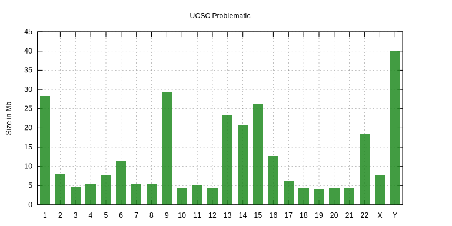

<a href="http://genome.ucsc.edu/cgi-bin/hgTrackUi?db=hg19&g=problematic" target="_blank"></pre></a>


# hg19problematic
Problematic Regions for NGS or Sanger sequencing or very variable regions

## Subtracks
* **UCSC Unusual Regions subtrack**
Annotations of fixed sequences, alternate haplotypes, unplaced contigs, pseudo-autosomal regions, and mitochondria that can yield alignments with low-quality mapping scores and discordant read pairs. This data set was manually curated, based on the Genome Browser's assembly description, the FAQs about assembly, and the NCBI RefSeq "other" annotations track data.

* **ENCODE Blacklist subtrack**
Contains a comprehensive set of regions which are troublesome for high-throughput Next-Generation Sequencing (NGS) aligners. These regions tend to have a very high ratio of multi-mapping to unique mapping reads and high variance in mappability due to repetitive elements such as satellite, centromeric and telomeric repeats.

* **Genome-In-A-Bottle (GIAB) track**
Contains defined regions where it is difficult to make a confident call, due to low coverage, systematic sequencing errors, and local alignment problems. These regions were identified from sequencing data generated by multiple technologies.

* **NCBI GeT-RM, Genetic Testing Reference Materials track**
Contains highly homologous gene- and exon-level regions difficult or impossible to analyze with standard Sanger or short-read NGS approaches and are relevant to current clinical testing.

## Region files

| Subtrack             | Description                                | bigBed file |
|----------------------|--------------------------------------------|-------------|
| UCSC Unusual Regions | UCSC unusual regions on assembly structure | comments.bb |
| ENCODE Blacklist | ENCODE Blacklist | encBlacklist.bb |
| NCBI NGS Dead Zone | NCBI GeT-RM NGS Dead Zone | deadZone.bb |
| NCBI Sanger Dead Zone | NCBI GeT-RM Sanger Dead Zone | sangerDeadZone.bb | 
| NCBI NGS Low Stringency | NCBI GeT-RM NGS Problem List, Low Stringency | ngsProblemLow.bb |
| NCBI NGS High Stringency | NCBI GeT-RM NGS Problem List, High Stringency | ngsProblemHigh.bb |
| GIAB filter SSE | NIST Genome-in-a-bottle: calls with evidence of systematic sequencing errors | filterSSE.bb |
| GIAB call conflict | NIST Genome-in-a-bottle: HaplotypeCaller makes no call and UnifiedGenotyper makes a variant call | filterHapNoVar.bb |
| GIAB quality issue | NIST Genome-in-a-bottle: calls with low mapping quality or high coverage | filterMap.bb |
| GIAB allele imbalance | NIST Genome-in-a-bottle: calls with abnormal allele balance | filterABQD.bb |
| GIAB align problem | NIST Genome-in-a-bottle: calls with evidence of local alignment problems like clipped reads | filterAlign.bb |
| GIAB genotype conflict | NIST Genome-in-a-bottle: calls with unresolved conflicting genotypes after arbitration | filterConflicting.bb |
| * | * | filterCov.bb |
| * | * | filterlt2Datasets.bb |

## Convert to bed

* get `bigBedToBed` from [http://hgdownload.cse.ucsc.edu/admin/exe/linux.x86_64/](http://hgdownload.cse.ucsc.edu/admin/exe/linux.x86_64/)

* Convert to bed (UCSC hg19)
```
url="http://hgdownload.soe.ucsc.edu/gbdb/hg19/bbi/problematic/"
for i in comments.bb deadZone.bb encBlacklist.bb filterAlign.bb filterABQD.bb \
         filterHapNoVar.bb filterCov.bb filterConflicting.bb filterlt2Datasets.bb \
         ngsProblemHigh.bb filterSSE.bb filterMap.bb sangerDeadZone.bb ngsProblemLow.bb;
do
  bigBedToBed $url/$i ${i%.bb}_hg19.bed;
done
```

* Convert to bed (NCBI GRCh37 primary)
```
for i in *_hg19.bed;
do
  awk '$1!~/_/ && $1!~/M/' $i | cut -f1-3 | cut -d'r' -f2- > ${i%_hg19.bed}_hs37_primary.bed
done
```

* Combine and make index
```
cat *_hs37_primary.bed | bedtk sort | bedtk merge | bgzip > problematic_hs37_primary.bed.gz
tabix !$
```

* Sizes by subtrack

| Subtracks (primary)     | Sizes (bp) |
|-------------------------|--------|
|comments_hs37_primary.bed|13905091|
|deadZone_hs37_primary.bed|975021|
|encBlacklist_hs37_primary.bed|274970000|
|filterABQD_hs37_primary.bed|114447|
|filterAlign_hs37_primary.bed|87763|
|filterConflicting_hs37_primary.bed|1443677|
|filterCov_hs37_primary.bed|34436|
|filterHapNoVar_hs37_primary.bed|13941|
|filterlt2Datasets_hs37_primary.bed|59190|
|filterMap_hs37_primary.bed|50115|
|filterSSE_hs37_primary.bed|10888|
|ngsProblemHigh_hs37_primary.bed|2040103|
|ngsProblemLow_hs37_primary.bed|3698806|
|sangerDeadZone_hs37_primary.bed|610029|

* Sizes by chr



* Total size: 291,510,704

## Reference

* `bedtk` [https://github.com/lh3/bedtk](https://github.com/lh3/bedtk)
* `bgzip` and `tabix` [https://github.com/samtools/tabix](https://github.com/samtools/tabix)
